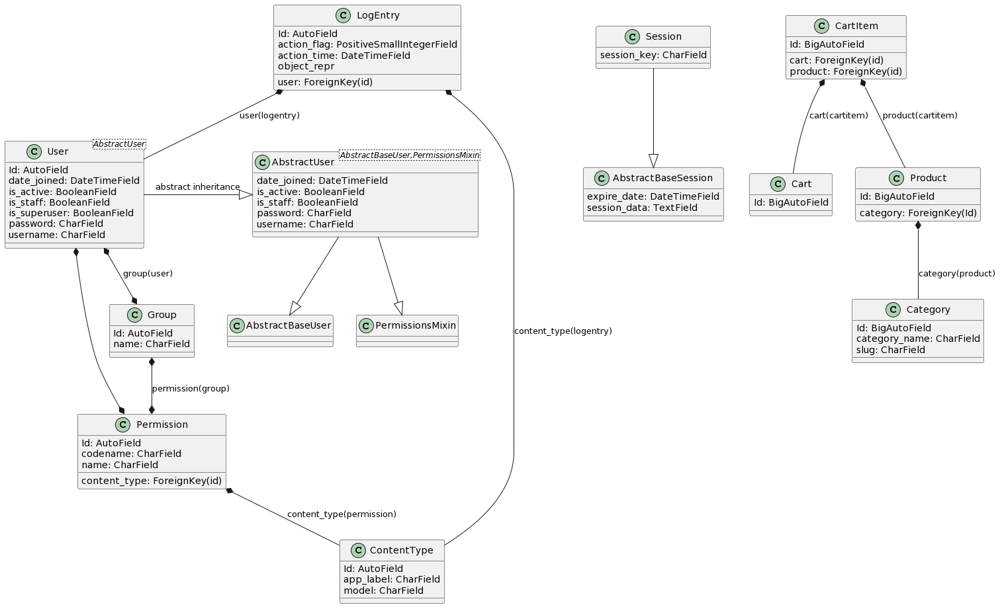

# Restaurante ChiKon

## Información
El restaurante Chi Kon es un restaurante de comida china, 
ubicado en la ciudad de Barranquilla-Colombia, en la cual 
ofrece servicios de domicilio, pero solamente llamando al 
número telefónico, y solo ofrece un solo número para la llamada, 
entonces cuando otros clientes llaman está ocupado el número, 
o coge demasiado tiempo hablando con el cliente, indicándoles 
los precios, el menú, etc., entonces este aplicativo web
permite facilitar este proceso, generando los datos del cliente,
y asi poder eviar el domicilio sin necesidad de la comunicación.

### Funcionalidad
este aplicativo web el cliente puede:
1. buscar el producto deseado, como su precio, la descripción, etc.
2. guardar los productos requeridos en un carrito de compras.
3. escribir su información de envio

### Diagrama UML 
